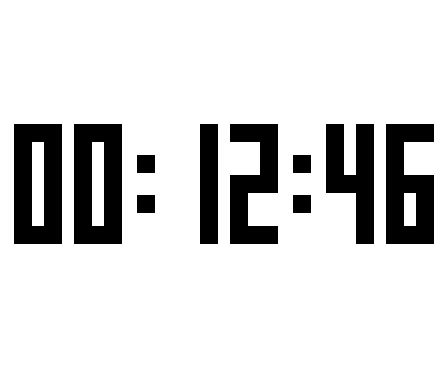
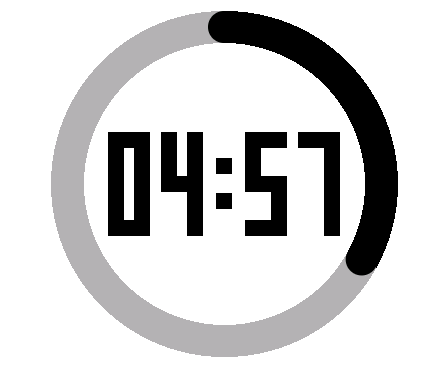

# The puck: a pocket toy

A stopwatch, a sketchpad and a countdown timer, in a plastic puck the size of a
large coin, for a child who cannot read yet. You pick between them by touching
one of three pictures.


| | |
|---|---|
|  |  |
|  |  |

Those are not mockups. Every image here is the real firmware's own
framebuffer, dumped by [`tools/screens.ts`](tools/screens.ts).

## Put it on your board

**This is for the Waveshare RP2350-Touch-AMOLED-1.8, and nothing else.** Not
the ESP32-S3 board of the same name, in the same case, sold on the same page,
which is a different chip and will not run this. Not the 1.43, 1.64, 1.75 or
2.41 siblings, which have different panels. If `picotool info` on your board
does not say `RP2350`, stop here.

1. Download **`puck-rp2350-amoled-1.8.uf2`** from
   [Releases](../../releases). It is one file, about 190 KB. Nothing else is
   needed, and no software gets installed on your computer.
2. Unplug the board. **Hold the upper of the two side buttons** (BOOT, with
   the screen facing you and the buttons on the right) and keep holding it.
3. **Keeping it held, plug the USB cable into your computer.** A drive called
   **`RP2350`** appears, the way a USB stick does. You can let go now.
4. **Drag the `.uf2` file onto that drive.** The drive disappears on its own
   after a second or two, and the screen lights up on the stopwatch. That is
   it; it is running, and it will run that firmware every time it is powered
   on from now on.

If no drive appears, the button was not held early enough: unplug, hold BOOT
first, and only then plug in. If you want your board back the way it was,
Waveshare's factory firmware is on their wiki page for it.

## Use it

Two side buttons. **PWR** is the lower one, **BOOT** the upper.

| | |
|---|---|
| **Change app** | Hold **both buttons** together for about a second and a half. Three pictures appear. Touch one. |
| | The same hold closes the picker again and goes back to what was running. |
| **Stopwatch** | PWR starts and stops. BOOT resets it to zero. |
| **Sketchpad** | Draw with a finger. **Shake the puck to erase**, which wipes in bands rather than blanking. Hold a finger still to open a grid of colours, then touch one. |
| **Timer** | Drag a finger around the ring to set a time. PWR starts and pauses. BOOT resets. It rings, flashes, and stops when you touch it. |

There is no clock, no battery indicator, no app name and no back arrow
anywhere. That is deliberate, and
[decision 0002](docs/decisions/0002-runtime-architecture.md) argues it.

**If it ever stops responding:** unplug it, hold PWR for a full 12 seconds
until the screen goes black, then hold BOOT while plugging the cable back in.
Replugging alone does not reset this board; the power chip keeps the rails up.

## Try it without a board

The other half of this repository is an emulator that runs this firmware's own
C, compiled a second time to WebAssembly, in a browser page. Same apps, same
rasteriser, same app-switching logic. From the repository root:

```
bun install
bun run device:build     # needs zig; writes wasm/dist/emu.wasm
bun run dev              # http://127.0.0.1:5340
```

Draw on the panel with the mouse, press the buttons in the page's chrome, hold
both for the app picker. What it can never answer is **timing**: whether this
feels fast is a question for the board, always. See the root
[`README.md`](../README.md) and
[decision 0003](docs/decisions/0003-emulator-runs-the-real-apps.md).

## Build the firmware yourself

You need the [Pico SDK](https://github.com/raspberrypi/pico-sdk) 2.x, the Arm
GNU Toolchain (`arm-none-eabi`), CMake and Ninja. `picotool` and `pioasm` come
from [`pico-sdk-tools`](https://github.com/raspberrypi/pico-sdk-tools) if your
platform cannot build the SDK's own (a Windows-on-ARM host cannot: there is no
host C compiler, and the prebuilt x64 ones run fine under emulation).

```
export PICO_SDK_PATH=/path/to/pico-sdk
export PICO_TOOLCHAIN_PATH=/path/to/arm-none-eabi

cmake -S device/firmware -B device/firmware/build -G Ninja
cmake --build device/firmware/build
```

That writes `device/firmware/build/main.uf2`. That file, renamed, is exactly
what the release carries: same bytes, no post-processing. `device/firmware/build/`
and `device/dist/` are both gitignored, so a `.uf2` is never committed here.
If `bun` is on your PATH, the build also runs
[`tools/invariants/`](tools/invariants/) over the linked image and **fails the
build** on a violation, which is [decision 0006](docs/decisions/0006-invariant-checker.md).

Flash it without touching a button, since `picotool` can reboot the board
itself:

```
picotool load device/firmware/build/main.uf2 -f -x
```

**Check any artefact before flashing it.** `picotool info -a <file>` should
report an image def and family `rp2350-arm-s`. A board that will not boot
cannot be reflashed over USB, and recovering it is the 12-second ritual above.

## Drive it without a human

`firmware/devlink.c` is a command interpreter riding the USB serial port the
firmware already prints to, and [`tools/dev.ts`](tools/dev.ts) is the host side
of it. Screenshots, taps, drags, drawn strokes, button injection and app
switching, all from a shell:

```
bun device/tools/dev.ts ping
bun device/tools/dev.ts shot out.png
bun device/tools/dev.ts tap 184 224
bun device/tools/dev.ts draw 20,20 60,40 100,30 140,60
bun device/tools/dev.ts chord            # open the app picker
```

`DEVLINK_PORT` and `DEVLINK_BAUD` override the defaults. The full wire
protocol, and an honest account of what injected buttons prove and what they
cannot (they skip the power chip's own register decode, which is exactly where
this project's one shipped bug in that area lived), is in
[`tools/README-devlink.md`](tools/README-devlink.md).

## Regression tests, no board required

[`wasm/tests/`](wasm/tests/) drives the compiled firmware through `emu_tick()`
with a synthetic clock and asserts on what a person at the device could also
have seen: framebuffer hashes and which app is running, never an internal
pointer. Each file reproduces a real bug.

```
bun run device/wasm/build.ts
bun run device/wasm/tests/repro-arena-not-zeroed.ts
bun run device/wasm/tests/repro-switch-input.ts
bun run device/wasm/tests/repro-timer-swallows-pwr-short-with-boot.ts
```

## What is in here

```
firmware/runtime/   the runtime: the board's entry point and startup, the
                    framebuffer and panel push, core1 (touch, IMU, power
                    chip), the sound path, and runtime_core.c, the portable
                    half that also compiles to WebAssembly.
firmware/apps/      one file per app: chrono.c, sketch.c, timer.c, plus
                    menu.c (the picker) and the shared digit/shape helpers.
                    None of them owns any hardware.
firmware/lib/       Waveshare's drivers, patched. See NOTICE.md, and read
                    AGENTS.md before re-copying any of them from upstream.
firmware/devlink.c  the USB command link tools/dev.ts talks to.
firmware/bootbtn.c  reads BOOT by borrowing the flash chip select, which is
                    a stranger thing to do than it sounds. Decision 0005.
wasm/               builds the same firmware to WebAssembly for the emulator
                    at the repository root, plus the regression tests.
tools/              dev.ts (drive the board), invariants/ (static checks over
                    the linked image, run by the build), screens.ts (the
                    images in this file), and the Lucide icon converters.
docs/decisions/     why things are the way they are. Start at its README.
preview/            the images above.
third_party/lucide/ five icons, ISC. See NOTICE.md.
```

[`AGENTS.md`](AGENTS.md) is the working document: the board's pin table, the
buttons the vendor header describes wrongly, and the gotchas that bite.
[`NOTICE.md`](NOTICE.md) is where the third-party code came from and under
what terms.
